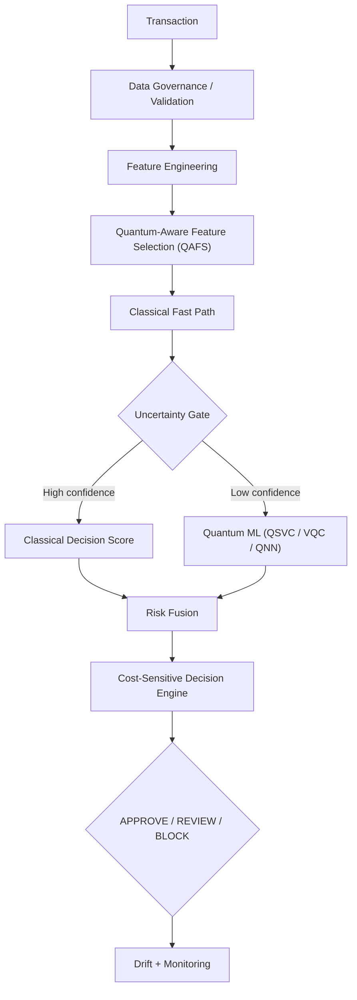

# Quantum-Gated Fraud Detection Architecture (QGFDA)

*A Resource-Aware Hybrid Quantum-Classical Framework for Credit Card Fraud Detection*

[](tests/)
[](https://www.ibm.com/quantum/qiskit)
[](pyproject.toml)
[](api/)
[](LICENSE)

> **Research Prototype — Not for Production Financial Authorization.**

## Table of contents

- [Project overview](#project-overview)
- [Research motivation and hypothesis](#research-motivation-and-hypothesis)
- [Architecture](#architecture)
- [Research gaps](#research-gaps)
- [Installation](#installation)
- [Dataset setup](#dataset-setup)
- [Qiskit setup](#qiskit-setup)
- [IBM Quantum setup (optional)](#ibm-quantum-setup-optional)
- [Running experiments](#running-experiments)
- [Running the dashboard](#running-the-dashboard)
- [Running the live web app (FastAPI + HTML5)](#running-the-live-web-app-fastapi--html5)
- [Production deployment](#production-deployment)
- [Notebooks](#notebooks)
- [Benchmark methodology](#benchmark-methodology)
- [Results](#results)
- [Limitations](#limitations)
- [Citation](#citation)
- [Future work](#future-work)

## Project overview

QGFDA is a complete, modular, reproducible research framework that
investigates whether a **selective quantum-classical architecture** can
offer a useful accuracy / false-positive / latency / resource trade-off for
credit card fraud detection, compared against strong classical baselines
(Logistic Regression, Random Forest, XGBoost, LightGBM).

A classical model scores every transaction. An **uncertainty gate** —
driven only by the classical model's own confidence, never by the ground-
truth label — routes the small fraction of genuinely ambiguous transactions
to a **Qiskit-based quantum classifier** (quantum kernel/QSVC, VQC, or QNN).
The two scores are combined by a configurable **risk fusion** strategy, and
a **cost-sensitive decision engine** issues one of `APPROVE` / `REVIEW` /
`BLOCK`, minimizing `ExpectedLoss = FN*fraud_loss + FP*false_positive_cost
+ n_review*review_cost`.

Every quantum model runs against the currently installed Qiskit 2.x API
(function-style feature maps/ansatzes, V2 Sampler/Estimator primitives) on
a local Aer simulator by default, with optional noisy-simulator and real
IBM Quantum hardware backends — see [`docs/reproducibility.md`](docs/reproducibility.md).

## Research motivation and hypothesis

This project does **not** set out to prove "quantum is better than
classical." The tested hypothesis is:

> *Selective quantum-classical inference may improve the fraud-detection
> accuracy-false-positive-resource trade-off for difficult transactions
> under constrained quantum resources.*

Every experiment is designed to evaluate this hypothesis honestly. If a
classical baseline wins on a given dataset/metric, that result is reported
as-is — `scripts/generate_report.py` builds `research_results.md` strictly
from recorded experiment data and renders `RESULT PENDING` for anything not
yet run, rather than inventing numbers. See
[`docs/methodology.md`](docs/methodology.md) for the full evaluation
protocol (why PR-AUC, never accuracy; leakage prevention; splitting
strategy; statistical significance testing).

## Architecture



Full module-by-module breakdown: [`docs/architecture.md`](docs/architecture.md).

```
quantum-credit-card-fraud-detection/
├── configs/            # datasets.yaml, models.yaml, quantum.yaml, experiments.yaml
├── data/                # raw/interim/processed (gitignored; see data/README.md)
├── notebooks/           # 01-09, executed with real outputs (plots + circuit diagrams)
├── src/
│   ├── config/          # settings.py — loads all YAML config, .env
│   ├── data/            # loaders, validators, preprocessing, feature engineering, imbalance
│   ├── classical/       # LR, RF, XGBoost, LightGBM + calibration
│   ├── quantum/         # feature maps, ansatzes, kernel, QSVC, VQC, QNN, QAFS, noise/backend manager
│   ├── hybrid/           # uncertainty gate, risk fusion, cost-sensitive engine, QGFDA orchestrator
│   ├── evaluation/       # metrics, temporal validation, statistical tests, ablation, resource analysis
│   ├── explainability/   # classical (SHAP/importance) + quantum (circuit transparency)
│   ├── experiments/      # run_classical/quantum/hybrid/noise/temporal.py
│   └── utils/            # logging, reproducibility, experiment tracker
├── dashboard/            # 9-page Streamlit research dashboard
├── api/                  # FastAPI backend for the live web app
├── frontend/             # HTML5/CSS/JS frontend served by the FastAPI backend
├── experiments/          # results/ (JSON + registry.csv), figures/, circuits/, logs/
├── tests/                # 74 tests, no IBM credentials required
├── docs/                 # architecture, methodology, experiments, research_gaps, reproducibility
└── scripts/              # download_data, preprocess_data, run_benchmark, generate_report
```

## Research gaps

Every simplification, approximation, or "this doesn't scale yet" honesty
note in the codebase is collected in one place:
[`docs/research_gaps.md`](docs/research_gaps.md). Highlights: quantum PCA is
capped at toy scale (classical PCA is the practical default), QAFS scores
candidate feature subsets with a classical surrogate rather than the full
quantum model, QAOA-based QUBO solving is gated to <=12 variables, and every
"novel contribution" claim is explicitly framed as *requiring comparison
with prior art*, not an established fact.

## Installation

```bash
python -m venv .venv
.venv\Scripts\activate          # Windows
# source .venv/bin/activate     # macOS/Linux

pip install --upgrade pip
pip install -r requirements.txt
```

Verified working versions (Python 3.11.9): qiskit 2.5.2,
qiskit-machine-learning 0.9.1, qiskit-aer 0.17.2, scikit-learn 1.9.0,
xgboost 3.2.0, lightgbm 4.7.0 — see
[`docs/reproducibility.md`](docs/reproducibility.md) for the full pinned
list and re-verification instructions.

## Dataset setup

```bash
cp .env.example .env            # then fill in KAGGLE_USERNAME / KAGGLE_KEY
python scripts/download_data.py --dataset ulb
```

No dataset is required to explore the code — every loader falls back to a
clearly-labeled **synthetic** sample (`src.data.loaders.load_synthetic`)
when the real file is absent. Full instructions for all 5 datasets (ULB,
IEEE-CIS, PaySim, BankSim, Fraud Detection Handbook) are in
[`docs/reproducibility.md`](docs/reproducibility.md) and
[`data/README.md`](data/README.md).

## Qiskit setup

Already covered by `pip install -r requirements.txt`. Sanity-check:

```bash
python -c "import qiskit, qiskit_machine_learning, qiskit_aer; print(qiskit.__version__)"
```

## IBM Quantum setup (optional)

```bash
# in .env:
IBM_QUANTUM_TOKEN=your-token-here
```

Pass `backend=ibm_quantum` to any quantum experiment. Missing credentials
or an unreachable service **fall back to the noisy simulator automatically**
— nothing in this project requires real hardware access to run.

## Running experiments

```bash
python scripts/preprocess_data.py --dataset ulb
python scripts/run_benchmark.py --dataset ulb --synthetic --suite quick
python scripts/run_benchmark.py --dataset ulb --suite full        # real data, full matrix

python -m src.experiments.run_classical --dataset ulb --model all
python -m src.experiments.run_quantum --dataset ulb --model vqc --qubits 6
python -m src.experiments.run_hybrid --dataset ulb --arm I_full_qgfda --all-arms
python -m src.experiments.run_noise --dataset ulb --model vqc
python -m src.experiments.run_temporal --dataset ulb --model xgboost

python scripts/generate_report.py       # -> research_results.md
```

Full experiment matrix (A-M) and the 9-arm ablation study:
[`docs/experiments.md`](docs/experiments.md).

## Running the dashboard

```bash
streamlit run dashboard/app.py
```

Nine pages: Executive Overview, Live Transaction Monitor, Classical vs
Quantum, Quantum Lab (renders real circuit diagrams), Feature Selection,
Hybrid QGFDA, Drift & Robustness, Research Experiments (explicit-trigger
only — no automatic expensive runs), and Research Results (CSV/JSON/PNG
export). Dark cybersecurity theme; every page carries the
"Research Prototype" banner and shows only anonymized/synthetic
transaction IDs — never real card data. All 9 pages verified via
Streamlit's `AppTest` framework with zero exceptions.

## Running the live web app (FastAPI + HTML5)

Alongside the Streamlit research dashboard, the project ships a second,
production-shaped web app: a **FastAPI** JSON backend (`api/`) serving a
plain **HTML5/CSS/JS** single-page frontend (`frontend/`) — no build step,
no framework, just `fetch()` calls against the API.

```bash
uvicorn api.main:app --reload --host 0.0.0.0 --port 8000
# or:
python -m api.main
```

Then open **http://localhost:8000/**. On first request (or on a cold start
with no persisted model yet) the backend trains a small demo QGFDA pipeline
in the background (~30-60s, prewarmed at startup) and **persists it to
`models/demo_pipeline/`** (classical model + preprocessing transformer via
joblib, the trained VQC's weights via Qiskit's own `to_dill`/`from_dill`);
every subsequent process restart warm-loads those artifacts instead of
retraining — verified to cut cold start from ~35s to ~1.3s. Every page calls
a real endpoint — nothing is pre-baked or faked:

| Endpoint | What it does |
|---|---|
| `GET /api/health` | Liveness probe — 200 as soon as the process is up |
| `GET /api/ready` | Readiness probe — 200 only once the demo pipeline has finished warming up; 503 otherwise, never blocks |
| `GET /api/overview` | Executive summary metrics (PR-AUC, recall, decision mix, routing %) |
| `WS /ws/live` | **Real-time push feed** — a fresh synthetic transaction is scored through the live pipeline and broadcast to every connected client roughly every `LIVE_FEED_INTERVAL_SECONDS` |
| `GET /api/transactions/live/recent` | Recent live-feed history from SQLite (backfills the table for clients that connect after the fact) |
| `GET /api/transactions/live/status` | Active WebSocket connection count + total transactions recorded |
| `POST /api/transactions/score` | Draws a fresh synthetic transaction, scores it through the **live** QGFDA pipeline end-to-end, persists it, and broadcasts it to every connected WebSocket client |
| `GET /api/quantum/summary` | Current demo pipeline's qubits/shots/optimizer/backend |
| `POST /api/quantum/circuit` | Builds a feature-map+ansatz circuit on demand and returns a rendered PNG (base64) + depth/gate metrics |
| `POST /api/feature-selection` | Runs QAFS across requested feature counts |
| `GET /api/drift` | PSI/KS drift report on the demo data |
| `POST /api/drift/robustness` | Controlled Amount-perturbation sensitivity sweep |
| `GET /api/experiments` | The full experiment registry, as JSON |
| `GET /api/experiments/export.csv` | The registry as a CSV download |
| `POST /api/experiments/run` | Explicitly triggers one experiment run (never automatic) |

The frontend's **Live Transactions** tab opens the WebSocket on page load, so
new transactions stream in and highlight automatically with zero polling —
open two browser tabs side by side and score a transaction in one to watch
it appear in both in real time.

Interactive OpenAPI docs are auto-generated at `/docs` (disabled when
`ENVIRONMENT=production`). Configure host/port/CORS/environment via `.env`
(`ENVIRONMENT`, `API_HOST`, `API_PORT`, `API_RELOAD`, `API_CORS_ORIGINS`,
`LIVE_FEED_INTERVAL_SECONDS`, `RATE_LIMIT_PER_MINUTE` — see `.env.example`);
tighten `API_CORS_ORIGINS` before exposing this beyond localhost. Every
route — including the WebSocket feed — is covered by `tests/test_api.py`
(21 tests) using FastAPI's `TestClient`, and was independently re-verified
against a real running `uvicorn` process with a real WebSocket client.

## Production deployment

The API ships with the hardening a real deployment needs, not just a demo
toggle:

- **Persistence, not retraining on every restart** — see the cold-start note
  above (`api/model_store.py`).
- **Real-time transaction history survives restarts** — every live-feed and
  manually-scored transaction is written to SQLite (`api/db.py`, WAL mode),
  not held only in memory.
- **Readiness vs liveness** — `/api/health` (liveness) and `/api/ready`
  (readiness) are separate, standard for a container orchestrator's health
  checks; `/api/ready` never itself triggers or blocks on a build.
- **Rate limiting** — an in-memory fixed-window limiter
  (`RATE_LIMIT_PER_MINUTE`, default 20/min per client IP) protects the
  genuinely expensive endpoints (`/api/experiments/run`,
  `/api/quantum/circuit`, `/api/feature-selection`) from being knocked over
  by a request flood.
- **Structured request logging** — every request is logged as
  `METHOD path -> status (latency_ms)`.
- **Environment-gated docs/errors** — `ENVIRONMENT=production` disables
  `/docs`/`/redoc`/`/openapi.json` and strips internal exception details
  from 500 responses (a global exception handler still returns a clean JSON
  error envelope instead of an unhandled traceback).
- **Thread-safe by construction** — matplotlib is forced to the
  non-interactive `Agg` backend (`api/services.py`), since FastAPI runs sync
  route handlers in worker threads and the GUI backend crashed under
  concurrent circuit-rendering requests during testing.

Run with Docker:

```bash
docker compose up --build
```

This builds the image (`Dockerfile`, non-root user, healthcheck baked in),
binds port 8000, and mounts named volumes for `models/` and `api/data/` so
the trained pipeline and live-feed database persist across container
rebuilds. Copy `.env.example` to `.env` first and set `API_CORS_ORIGINS` to
your real frontend origin(s) before exposing this beyond localhost.

**Scaling note**: the demo-pipeline singleton and WebSocket connection
manager live in this process's memory, so run exactly **one** uvicorn worker
per container (already the Dockerfile's default) and scale out with
multiple containers behind a load balancer with sticky WebSocket routing —
raising `--workers` inside a single container will NOT share that state
correctly across workers. Moving the connection manager to a pub/sub broker
(e.g. Redis) is the natural next step for true horizontal scaling; that is
not implemented here and is called out honestly rather than glossed over.

## Notebooks

`notebooks/01`-`09` are pre-executed (via `nbformat`+`nbclient` against the
project's own venv) and ship with real embedded outputs — plots, quantum
circuit diagrams, and result tables — not empty cells:

| # | Notebook | Covers |
|---|---|---|
| 01 | `data_exploration` | Class balance, amount distribution, correlation heatmap |
| 02 | `classical_baselines` | LR/RF/XGBoost/LightGBM comparison, PR curves, confusion matrix |
| 03 | `quantum_feature_selection` | Mutual information, classical PCA, QAFS trade-off curve, toy quantum PCA |
| 04 | `qsvc_quantum_kernel` | ZZ feature map circuit, quantum kernel matrix heatmap, QSVC |
| 05 | `vqc` | Feature map + ansatz circuit, VQC training convergence |
| 06 | `qnn` | EstimatorQNN vs SamplerQNN circuit + comparison |
| 07 | `hybrid_qgfda` | Full QGFDA run: routing, decisions, classical-vs-quantum risk |
| 08 | `noise_analysis` | Shots x ideal/noisy backend sweep |
| 09 | `temporal_drift` | Rolling-window PR-AUC degradation, PSI/KS drift stats |

Open with `jupyter notebook` (kernel: register via
`python -m ipykernel install --user --name qgfda --display-name "QGFDA (.venv)"`).

## Benchmark methodology

Primary metric: **PR-AUC** (never accuracy — meaningless at a <2% fraud
rate). Reported alongside ROC-AUC, precision, recall, F1, FPR, FNR, MCC,
Brier score, and ExpectedLoss. Full methodology, leakage-prevention
measures, and statistical-significance testing:
[`docs/methodology.md`](docs/methodology.md).

## Results

`research_results.md` (repo root) is auto-generated by
`scripts/generate_report.py` directly from
`experiments/results/experiment_registry.csv` — every number is either a
real recorded result or `RESULT PENDING`. Regenerate it after running your
own experiments; do not treat any numbers committed to this repo as final
research conclusions until they come from real (non-synthetic) dataset runs.

## Limitations

See [`docs/research_gaps.md`](docs/research_gaps.md) for the complete list.
In short: quantum kernel training is subsampled (O(n^2) cost), QAFS scores
candidates with a classical surrogate, QAOA-based QUBO solving is capped at
~12 variables, simulator noise models are simplified relative to real
device calibration, and quantum "explainability" is a transparency report,
not a SHAP equivalent.

## Citation

```bibtex
@software{qgfda2026,
  title  = {Quantum-Gated Fraud Detection Architecture (QGFDA): A Resource-Aware
            Hybrid Quantum-Classical Framework for Credit Card Fraud Detection},
  year   = {2026},
  url    = {https://github.com/Uttpal-Tripathy/quantum-credit-card-fraud-detection}
}
```

## Future work

- Cross-dataset validation (Experiment L) across all 5 configured datasets.
- Real IBM Quantum hardware runs (Experiment M) to validate simulator-based
  noise conclusions.
- Literature comparison for every claim in
  [`docs/research_gaps.md`](docs/research_gaps.md) §8 before any novelty
  claim is made in a publication.
- Replace QAFS's classical surrogate scoring with direct quantum-model
  evaluation once a tractable search strategy is identified.
