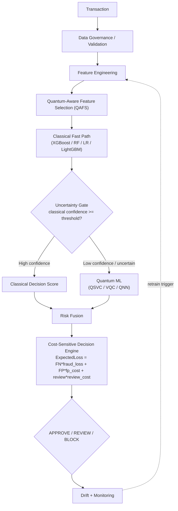

# QGFDA System Architecture

## Overview

The Quantum-Gated Fraud Detection Architecture (QGFDA) is a resource-aware
hybrid quantum-classical pipeline. A classical model handles the vast
majority of transactions; only transactions the classical model is
*genuinely uncertain about* are escalated to a quantum classifier. The two
scores are fused, and a cost-sensitive engine issues a three-way decision.

## Module map

| Layer | Path | Responsibility |
|---|---|---|
| Config | `src/config/settings.py` | Loads `configs/*.yaml`, resolves paths, reads `.env` |
| Data | `src/data/*.py` | Loaders (5 datasets + synthetic), validators, preprocessing, feature engineering, imbalance handling |
| Classical | `src/classical/*.py` | LR, RF, XGBoost, LightGBM wrappers + calibration + threshold tuning |
| Quantum | `src/quantum/*.py` | Feature maps, ansatzes, quantum kernel, QSVC, VQC, QNN, quantum PCA, QUBO/QAFS feature selection, circuit metrics, noise models + backend manager |
| Hybrid | `src/hybrid/*.py` | Uncertainty gate, risk fusion, cost-sensitive decision engine, the `QGFDA` orchestrator |
| Evaluation | `src/evaluation/*.py` | Metrics (PR-AUC primary), temporal validation, statistical/drift tests, ablation table, resource-vs-performance plots |
| Explainability | `src/explainability/*.py` | Classical (SHAP/permutation/native importance) and quantum (circuit transparency report, NOT a SHAP equivalent) |
| Experiments | `src/experiments/*.py` | Orchestration: runs a pipeline end-to-end and records results |
| Utils | `src/utils/*.py` | Logging, reproducibility (seeds + software versions), experiment tracker (JSON + CSV registry) |
| Dashboard | `dashboard/` | 9-page Streamlit research/demo UI |
| Scripts | `scripts/*.py` | Thin CLIs over `src/experiments/*` |

## Backend selection (simulator -> noisy -> hardware)

`src/quantum/noise_models.get_primitives(backend, shots, seed)` is the single
entry point every quantum model uses to obtain Sampler/Estimator V2
primitives:

- `backend="simulator"` — ideal `AerSimulator`.
- `backend="noisy_simulator"` — `AerSimulator` with a configurable
  depolarizing + readout noise model (`configs/quantum.yaml: noise.*`).
- `backend="ibm_quantum"` — real IBM Quantum hardware via
  `qiskit-ibm-runtime`, using `IBM_QUANTUM_TOKEN` from `.env`. If the token is
  missing or the service call fails for any reason, execution **falls back
  to the noisy simulator with a logged warning** rather than raising — the
  rest of the pipeline never crashes for lack of hardware credentials.

## Why gating, not routing-by-label

The uncertainty gate (`src/hybrid/uncertainty_gate.py`) routes strictly on
the classical model's own predicted probability — never on the ground-truth
fraud label, which would leak information unavailable at real inference
time. This is enforced by the gate's `.route(scores)` signature: it does not
accept `y_true`, and `tests/test_hybrid.py::test_gate_never_uses_ground_truth_label`
asserts this at the type-signature level.
